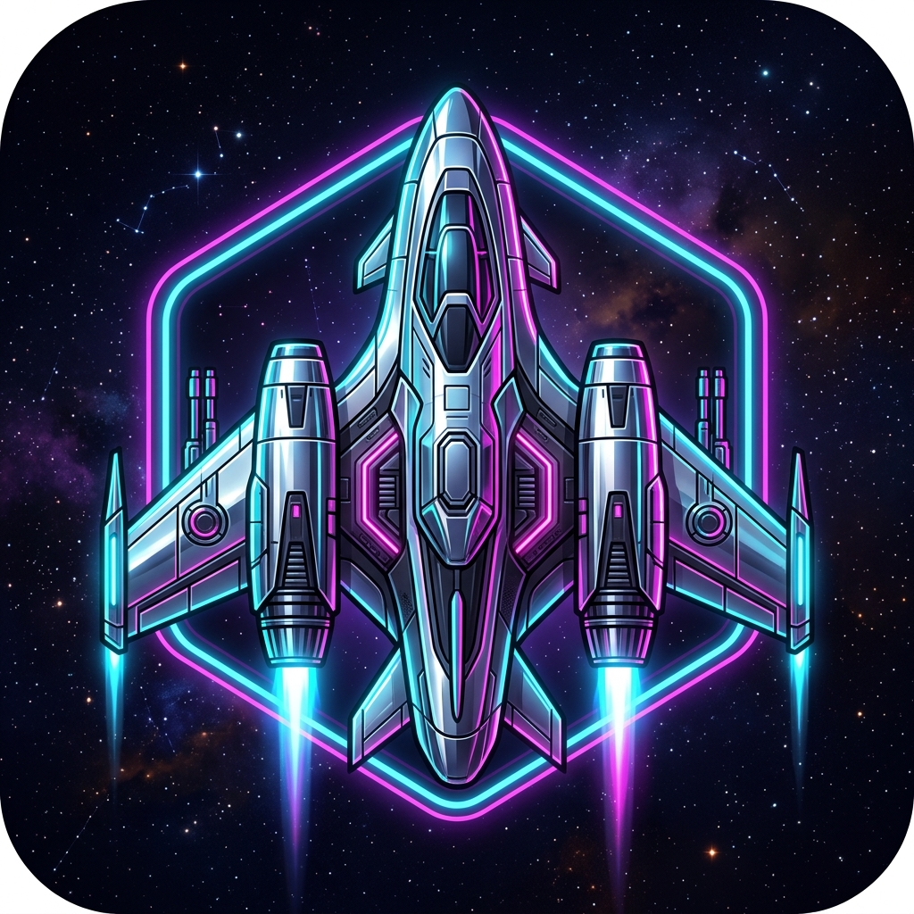

# 🚀 NAVES - Aventura Espacial Synthwave

Un emocionante videojuego tipo **shoot'em up** arcade con una estética retro-futurista premium, diseñado para 1 o 2 jugadores. ¡Enfréntate a oleadas de enemigos inteligentes, domina el espacio y establece nuevos récords!



## 🌟 Características Destacadas

- **🎮 Soporte Total para Mando**: Navegación fluida por menús y control total de la nave con Gamepad.
- **👥 Cooperativo Local**: Juega solo o con un amigo en una batalla épica por la supervivencia.
- **✨ Estética Synthwave**: Gráficos con efectos de neón, resplandores cromados y atmósfera CRT.
- **🧠 IA Adaptativa**: Enemigos que patrullan, persiguen y coordinan ataques según tu nivel de habilidad.
- **🔥 Dificultad Escalable**: Desde el modo "Fácil" para principiantes hasta el modo "PESADILLA" para expertos.
- **💾 Persistencia de Datos**: Tus ajustes y el Récord Global (High Score) se guardan automáticamente.
- **📦 Listo para Ejecutable**: Incluye botón de salida y optimizaciones para ser convertido en aplicación nativa (.exe).

## 🎮 Controles

### Jugador 1 (Nave Roja)
| Acción | Teclado | Gamepad |
| :--- | :--- | :--- |
| **Movimiento** | `W/A/S/D` o `Flechas` | `Stick Izquierdo` / `D-Pad` |
| **Disparo** | `Espacio` | `Botón A / Gatillo R` |
| **Pausa** | `P` | `Botón Start` |

### Jugador 2 (Nave Azul)
| Acción | Teclado | Gamepad |
| :--- | :--- | :--- |
| **Movimiento** | `I/J/K/L` | `Stick Izquierdo` / `D-Pad` |
| **Disparo** | `U` o `O` | `Botón A / Gatillo R` |

---

## 🛠️ Requisitos e Instalación

### Ejecución en Navegador
Para la mejor experiencia, se recomienda usar un servidor local (debido a políticas de seguridad de archivos locales en navegadores modernos):

**Con Node.js (Recomendado):**
```bash
npx http-server
```

**Con Python:**
```bash
python -m http.server 8000
```

---

## 📋 Estructura del Proyecto

```
Juego de Naves/
├── index.html              # Estructura UI, Menús y Canvas
├── favicon.png             # Icono oficial del juego
├── src/
│   ├── css/
│   │   └── styles.css      # Estilos Synthwave y animaciones
│   └── js/
│       ├── main.js         # Inicialización del sistema
│       ├── game.js         # Motor principal y lógica de juego
│       ├── player.js       # Control y física de naves aliadas
│       ├── enemy.js        # Lógica de enemigos y tipos
│       ├── ai.js           # Sistema de Inteligencia Artificial
│       ├── audio.js        # Gestor de efectos y música
│       └── utils.js        # Ayudantes matemáticos y de colisión
```

## ⚙️ Configuración y Dificultad

Puedes ajustar tu experiencia desde el menú de **Ajustes**:
- ** 🌱 Fácil**: Menos enemigos y más lentos. Ideal para aprender.
- ** ⚡ Normal**: El balance perfecto entre reto y diversión.
- ** 🔥 Difícil**: Enemigos más agresivos y con mayor cadencia de disparo.
- ** 💀 PESADILLA**: Solo para leyendas. Doble de enemigos, doble de vida y daño letal.

---

## 🆕 Últimas Actualizaciones (v1.2.0)

- **Menú de Selección de Modo**: Nuevo flujo para elegir 1 o 2 jugadores al iniciar.
- **Sistema de Récords**: Ahora el juego guarda y muestra tu mejor puntuación global.
- **Optimización de Mando**: Corregidos todos los problemas de enfoque en menús y pausa.
- **Branding**: Iconografía personalizada e interfaz de usuario refinada con efectos de cristal.
- **Bug Fixes**: Solucionado el error de checkboxes al inicio y mejora en la lógica de retorno al menú.

---

